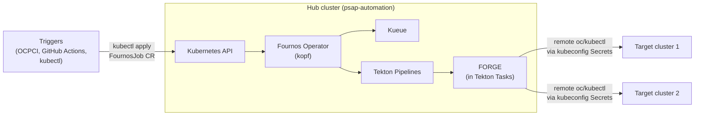
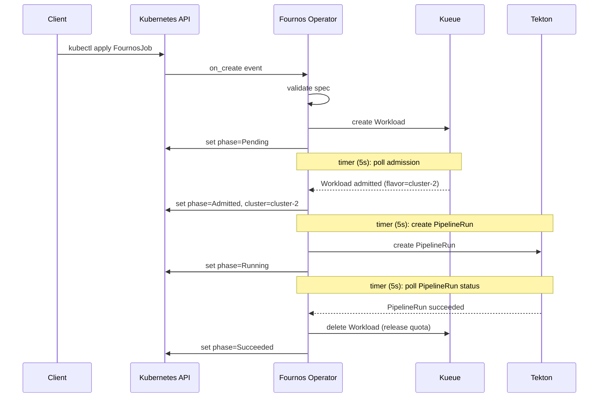

# Fournos Design Document (Tekton + Kueue)

## 1. Introduction

*Fournos* (φούρνος) = "oven" in Greek. A Kubernetes operator that accepts benchmark jobs as `FournosJob` custom resources, schedules them via Kueue, and executes them as Tekton PipelineRuns on remote clusters through the FORGE framework.

The operator is built with [kopf](https://kopf.dev/) (Kubernetes Operator Pythonic Framework) and runs as a single-replica Deployment.

## 2. Architecture overview




- **Hub cluster**: hosts the Fournos operator, Kueue, Tekton Pipelines, and FORGE (running inside Tekton Task pods) in the `psap-automation` namespace
- **Target clusters**: nothing installed — FORGE runs on the hub cluster inside Tekton Task pods and communicates with targets via remote `oc`/`kubectl` commands using kubeconfig Secrets
- **Consumers**: interact via `kubectl` (or any Kubernetes client) to create/watch/delete `FournosJob` CRs

## 3. FournosJob CRD

Jobs are submitted as `FournosJob` custom resources ([manifests/crd.yaml](manifests/crd.yaml)).

### Spec


| Field                        | Required     | Description                                           |
| ---------------------------- | ------------ | ----------------------------------------------------- |
| `spec.forge.project`         | yes          | FORGE project path                                    |
| `spec.forge.preset`          | yes          | FORGE preset name                                     |
| `spec.forge.configOverrides` | no           | Key-value overrides passed to the test framework      |
| `spec.env`                   | no           | Environment variables for test identification         |
| `spec.cluster`               |              | Pin to a specific cluster (Kueue ResourceFlavor)      |
| `spec.hardware.gpuType`      |              | GPU model (e.g. `A100`, `H200`)                       |
| `spec.hardware.gpuCount`     | with gpuType | Number of GPUs (minimum 1)                            |
| `spec.owner`                 | no           | Team or individual that owns this job                 |
| `spec.displayName`           | no           | Human-readable job name (defaults to `metadata.name`) |
| `spec.pipeline`              | no           | Tekton Pipeline name (default: `fournos-full`)        |
| `spec.priority`              | no           | Kueue WorkloadPriorityClass name                      |
| `spec.secrets`               | no           | Additional Secret names for the pipeline              |


 At least one of `spec.cluster` or `spec.hardware` must be provided. Both can be set together to pin a hardware request to a specific cluster.

`metadata.name` is the unique identifier for the job. Use `metadata.generateName` for auto-generated unique names (e.g. `generateName: nightly-benchmark-` produces `nightly-benchmark-x7k2m`). `spec.displayName` is a human-readable label for external correlation — it does not need to be unique and is passed to the pipeline as `job-name`.

### Status

The operator writes status to `.status`:


| Field          | Description                                                 |
| -------------- | ----------------------------------------------------------- |
| `phase`        | `Pending` → `Admitted` → `Running` → `Succeeded` / `Failed` |
| `cluster`      | Cluster assigned by Kueue                                   |
| `pipelineRun`  | Name of the Tekton PipelineRun                              |
| `dashboardURL` | Tekton Dashboard link (if configured)                       |
| `message`      | Error details on failure                                    |


### Example

```yaml
apiVersion: fournos.dev/v1
kind: FournosJob
metadata:
  generateName: nightly-llama3-
  namespace: psap-automation
spec:
  owner: perf-team
  displayName: nightly-llama3-benchmark
  cluster: cluster-1
  forge:
    project: testproj/llmd
    preset: cks
  env:
    OCPCI_SUITE: regression
    OCPCI_VARIANT: nightly
```

```bash
kubectl create -f job.yaml           # returns the generated name, e.g. nightly-llama3-x7k2m
kubectl get fournosjobs -w           # watch status transitions
kubectl delete fournosjob <name>     # cleanup
```

## 4. Scheduling

All jobs flow through Kueue — there is one scheduling path with different constraint levels:


| User specifies                             | Workload nodeSelector                          | Kueue behavior                                                          |
| ------------------------------------------ | ---------------------------------------------- | ----------------------------------------------------------------------- |
| `cluster: "cluster-1"`                     | `fournos.dev/cluster: cluster-1`               | Only the `cluster-1` flavor is eligible. Queues if the cluster is full. |
| `hardware: {gpuType: "A100", gpuCount: 2}` | *(none)*                                       | All flavors with enough A100 quota are eligible. Kueue picks first fit. |
| Both                                       | `fournos.dev/cluster: cluster-1` + GPU request | Specific hardware on a specific cluster.                                |


Each ResourceFlavor has `spec.nodeLabels: { fournos.dev/cluster: <name> }`. When `cluster` is specified, the operator sets a matching `nodeSelector` on the Workload's podSet template so Kueue constrains admission to that flavor.

### Job lifecycle




1. **on_create**: Operator validates the spec (cluster exists, at least one of cluster/hardware), creates a Kueue Workload, sets `phase=Pending`
2. **timer (Pending)**: Polls the Workload for Kueue admission. On admission, reads the assigned flavor (= cluster name), sets `phase=Admitted`
3. **timer (Admitted)**: Resolves the kubeconfig Secret, creates the Tekton PipelineRun, sets `phase=Running`
4. **timer (Running)**: Polls the PipelineRun for completion. On success/failure, deletes the Workload and sets `phase=Succeeded` or `phase=Failed`
5. **on_delete**: Cleans up associated Workload and PipelineRun

Benefits of the unified path:

- Quota is always tracked, even for cluster-pinned jobs
- If the requested cluster is full, the job queues instead of failing
- Priority ordering applies consistently
- One code path for scheduling (simpler)

## 5. Operator handlers

The operator is implemented in `fournos/operator.py` using [kopf](https://kopf.dev/) decorators:


| Handler                               | Trigger                                             | Responsibility                                                               |
| ------------------------------------- | --------------------------------------------------- | ---------------------------------------------------------------------------- |
| `@kopf.on.startup`                    | Process start                                       | Load kubeconfig, initialise clients, start resource GC thread                |
| `@kopf.on.create` / `@kopf.on.resume` | New or existing CR                                  | Validate spec, create Workload, set `phase=Pending`                          |
| `@kopf.timer(interval=5.0)`           | Every 5s while phase ∈ {Pending, Admitted, Running} | Drive the state machine: poll admission, create PipelineRun, poll completion |
| `@kopf.on.delete`                     | CR deletion                                         | Delete associated Workload and PipelineRun                                   |


The timer's `when` guard ensures it stops firing once the job reaches a terminal phase (`Succeeded` or `Failed`), so completed jobs have zero ongoing overhead.

Validation failures (unknown cluster, missing cluster/hardware) result in immediate `phase=Failed` with a descriptive `message` — no Workload is created.

### Resource GC

A background daemon thread runs a garbage collection loop at a configurable interval (`FOURNOS_GC_INTERVAL_SEC`, default 300s). It lists all fournos-managed Workloads and PipelineRuns (by label `app.kubernetes.io/managed-by=fournos`), reads the `fournos.dev/job-name` label on each, and deletes any whose parent `FournosJob` CR no longer exists. This handles edge cases where the operator's `on_delete` handler fails or a CR is force-deleted.

## 6. Persistence

Job state is stored entirely in Kubernetes resources — no in-memory store:

- **FournosJob CRs**: the primary user-facing resource; `.status` tracks phase, assigned cluster, PipelineRun name, dashboard URL
- **Kueue Workloads**: carry job name as labels; admission state from conditions and `status.admission.podSetAssignments`
- **Tekton PipelineRuns**: carry job name as labels; execution status from conditions

The operator is stateless and crash-safe. On restart, `@kopf.on.resume` re-evaluates existing CRs and the timer picks up where it left off.

## 7. FORGE integration

FORGE is an existing benchmark execution framework that runs on the hub cluster inside Tekton Task pods and owns all operations on target clusters — setup, benchmark execution, and cleanup — by issuing remote `oc`/`kubectl` commands via kubeconfig Secrets. Fournos has a strict separation of concerns: it handles cluster selection, scheduling, and bookkeeping, but never interacts with target clusters directly. All FORGE parameters (`project`, `preset`, `configOverrides`) are passed through opaquely to the Tekton Pipeline as params, along with `spec.env` for test identification. Fournos also passes `job-name` (from `spec.displayName` or `metadata.name`) so FORGE can use it for its own resource naming and correlation.

The Tekton Task definitions in `manifests/tekton/tasks.yaml` are stub implementations showing the expected parameter interface. The real FORGE tasks will replace them.

## 8. Tekton Pipelines and Tasks

### Tasks ([manifests/tekton/tasks.yaml](manifests/tekton/tasks.yaml))

FORGE-owned tasks (stubs in this repo, replaced by real FORGE implementation):


| Task              | Description                                         |
| ----------------- | --------------------------------------------------- |
| `fournos-prepare` | FORGE: set up the target cluster                    |
| `fournos-run`     | FORGE: run the benchmark against the target cluster |
| `fournos-cleanup` | FORGE: clean up resources on the target cluster     |


### Pipelines


| Pipeline           | File                                                              | Tasks         | Finally  |
| ------------------ | ----------------------------------------------------------------- | ------------- | -------- |
| `fournos-full`     | [pipeline-full.yaml](manifests/tekton/pipeline-full.yaml)         | prepare → run | cleanup  |
| `fournos-run-only` | [pipeline-run-only.yaml](manifests/tekton/pipeline-run-only.yaml) | run           | *(none)* |


The `spec.pipeline` field in `FournosJob` selects which pipeline to use (default: `fournos-full`).

Completion detection is handled by the operator's timer polling PipelineRun conditions — no callback task is needed.

## 9. Kueue configuration

[manifests/kueue-config.yaml](manifests/kueue-config.yaml):

- **ResourceFlavors**: one per cluster, with `nodeLabels: { fournos.dev/cluster: <name> }` for cluster-pinned scheduling
- **ClusterQueue** `fournos-queue`: per-cluster GPU quotas using virtual resource `fournos/gpu-{type}`
- **LocalQueue** in `psap-automation` namespace
- **WorkloadPriorityClasses** (v1beta2): `manual`, `nightly`, `presubmit`, `adhoc`

## 10. Deployment

Namespace-scoped tenant on a shared OpenShift management cluster:

- [manifests/crd.yaml](manifests/crd.yaml) — FournosJob CustomResourceDefinition
- [manifests/rbac.yaml](manifests/rbac.yaml) — ClusterRole + ClusterRoleBinding for Kueue cluster resources; Role + RoleBinding for FournosJob, PipelineRun, Secret access
- [manifests/deployment.yaml](manifests/deployment.yaml) — Deployment in `psap-automation` with liveness probe
- [Containerfile](Containerfile) — Python base image, pip install, `kopf run` entrypoint with liveness endpoint

```bash
kubectl apply -f manifests/crd.yaml
kubectl apply -f manifests/rbac.yaml
kubectl apply -f manifests/kueue-config.yaml
kubectl apply -f manifests/tekton/
kubectl apply -f manifests/deployment.yaml
```

## 11. Configuration

All settings via environment variables with `FOURNOS_` prefix ([fournos/settings.py](fournos/settings.py)):


| Variable                            | Default                | Description                    |
| ----------------------------------- | ---------------------- | ------------------------------ |
| `FOURNOS_NAMESPACE`                 | `psap-automation`      | Kubernetes namespace           |
| `FOURNOS_TEKTON_DASHBOARD_URL`      | *(empty)*              | Tekton Dashboard base URL      |
| `FOURNOS_KUBECONFIG_SECRET_PATTERN` | `{cluster}-kubeconfig` | Secret name pattern            |
| `FOURNOS_KUEUE_LOCAL_QUEUE_NAME`    | `fournos-queue`        | Kueue LocalQueue name          |
| `FOURNOS_GPU_RESOURCE_PREFIX`       | `fournos/gpu-`         | Virtual resource name prefix   |
| `FOURNOS_LOG_LEVEL`                 | `INFO`                 | Logging level                  |
| `FOURNOS_GC_INTERVAL_SEC`           | `300`                  | Resource GC interval (seconds) |


## 12. Project structure

```
fournos/
  operator.py              # kopf operator (startup, create/resume, timer, delete handlers)
  settings.py              # Pydantic Settings (env vars)
  core/
    constants.py           # Shared label keys
    clusters.py            # ClusterRegistry (Secret lookup)
    tekton.py              # TektonClient (PipelineRun CRUD)
    kueue.py               # KueueClient (Workload CRUD, admission checks)
manifests/
  crd.yaml                 # FournosJob CustomResourceDefinition
  kueue-config.yaml        # ClusterQueue, ResourceFlavors, LocalQueue, WorkloadPriorityClasses
  rbac.yaml                # Role, ClusterRole, RoleBinding, ClusterRoleBinding
  deployment.yaml          # Deployment
  tekton/                  # Tasks, fournos-full Pipeline, fournos-run-only Pipeline
dev/
  setup.sh                 # kind cluster setup (Tekton + Kueue + CRD + mock resources)
  mock-kueue-config.yaml   # Dev Kueue config (mock clusters, quotas)
  mock-resources.yaml      # Mock Tasks, Pipelines, kubeconfig Secrets
  sample-job.yaml          # Example FournosJob CR for testing
tests/
  conftest.py              # Fixtures (kubernetes client, helpers, cleanup)
  test_scheduling.py       # Cluster pin, hardware, both, alt pipeline, inadmissible, wrong GPU, optional spec fields
  test_validation.py       # Missing target, unknown cluster
  test_lifecycle.py        # Workload cleanup, delete cleanup, list, filter by phase
  test_resource_gc.py      # Stale Workload/PipelineRun garbage collection
Containerfile
Makefile                   # dev-setup, dev-run, test, dev-teardown, ci-setup, ci-run, ci-stop, lint, format
pyproject.toml
.pre-commit-config.yaml    # ruff lint + format hooks
README.md
```

## 13. Key design decisions

- **CRD-based operator** (kopf) — consumers interact via `kubectl` / Kubernetes API, getting RBAC, audit logging, and `kubectl wait` for free
- **Unified Kueue scheduling** — all jobs flow through Kueue for consistent quota tracking and priority ordering. Cluster-pinned jobs use `nodeSelector` to constrain admission to a single ResourceFlavor; hardware-request jobs leave all flavors eligible.
- **Separation of concerns** — Fournos owns scheduling, bookkeeping, and parameter passing; FORGE owns all target-cluster operations (setup, execution, cleanup). Fournos never touches target clusters directly.
- **FORGE is opaque** — Fournos never validates FORGE config, just passes parameters through to the Tekton Pipeline
- **Tekton for execution, Kueue for scheduling** — virtual Workload pattern with `fournos/gpu-`* resources
- **Stateless operator** — all job state lives in Kubernetes resources (FournosJob CRs, PipelineRuns, Workloads), not in memory. Crash-safe via `on_resume`.
- **Timer-based reconciliation** — the operator polls Workload admission and PipelineRun completion via a kopf timer (5s interval), eliminating the need for callback tasks or watch streams on third-party resources
- **Operator cleans up on completion** — Kueue Workloads are deleted when the PipelineRun reaches a terminal state, releasing quota without relying on external callbacks
- **Multiple pipelines** — `fournos-full` (prepare → run → cleanup) and `fournos-run-only` (run only), selectable per job
- **Target clusters need nothing installed** — FORGE runs on the hub cluster inside Tekton Task pods and communicates with targets via remote `oc`/`kubectl` commands through kubeconfig Secrets

