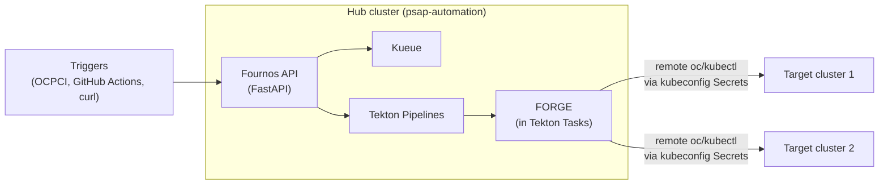
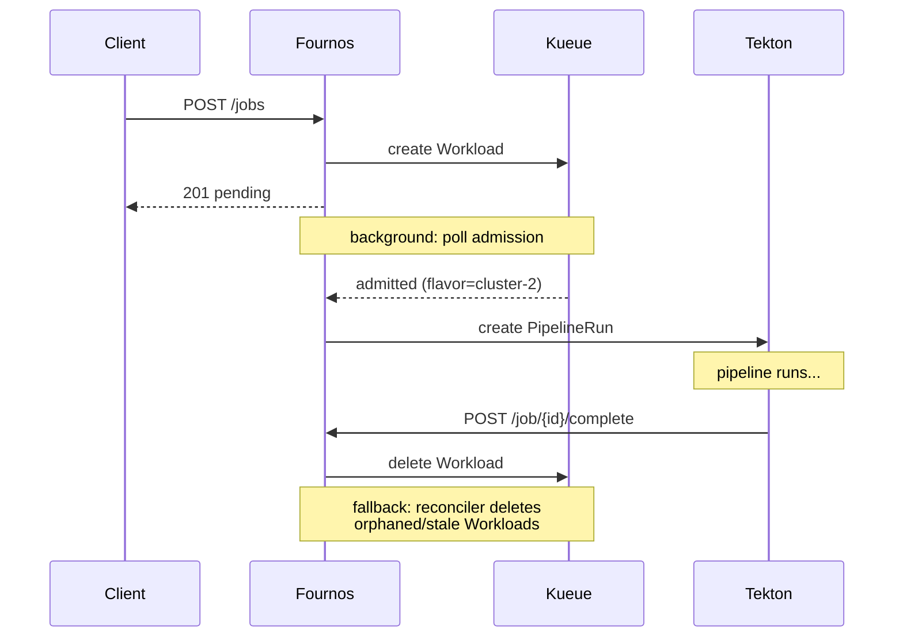

# Fournos Design Document (Tekton + Kueue)

## 1. Introduction

*Fournos* (φούρνος) = "oven" in Greek. A Python-based HTTP service (FastAPI) that accepts benchmark jobs, schedules them via Kueue, and executes them as Tekton PipelineRuns on remote clusters through the FORGE framework.

## 2. Architecture overview




- **Hub cluster**: hosts Fournos, Kueue, Tekton Pipelines, and FORGE (running inside Tekton Task pods) in the `psap-automation` namespace
- **Target clusters**: nothing installed — FORGE runs on the hub cluster and communicates with targets via remote `oc`/`kubectl` commands using kubeconfig Secrets

## 3. API

### POST /api/v1/jobs — submit a job (201)

Request body:


| Field      | Type   | Required | Description                                                      |
| ---------- | ------ | -------- | ---------------------------------------------------------------- |
| `name`     | string | yes      | Job name                                                         |
| `pipeline` | string | no       | Tekton Pipeline name (default: `fournos-full`)                   |
| `cluster`  | string | no       | Pin to a specific cluster (Kueue nodeSelector constraint)        |
| `hardware` | object | no       | `{gpu_type, gpu_count}` — GPU request for Kueue quota scheduling |
| `forge`    | object | yes      | `{project, preset, args[]}` — passed through to Tekton Task      |
| `secrets`  | list   | no       | Secret names to mount in the runner pod                          |
| `priority` | string | no       | Kueue `WorkloadPriorityClass` name                               |


At least one of `cluster` or `hardware` must be provided. Both can be specified together to request specific hardware on a specific cluster.

Returns `JobStatusResponse`.

### GET /api/v1/jobs — list jobs (200)

Query params: `?status=pending|admitted|running|succeeded|failed` (optional filter).

Merges PipelineRuns and Kueue Workloads (deduplicated by job ID). Returns `JobListResponse` with `jobs[]` and `count`.

### GET /api/v1/job/{id} — job status (200)

Query params: `?wait=true` for long-poll until terminal state.

Looks up PipelineRun first, falls back to Kueue Workload. Returns `JobStatusResponse` with fields: `id`, `name`, `status`, `cluster`, `pipeline_run`, `dashboard_url`.

### POST /api/v1/job/{id}/complete — completion callback (204)

Called by the Tekton `fournos-notify` finally-task (or externally) when a pipeline finishes. Deletes the Kueue Workload to release quota. Idempotent — safe to call repeatedly.

### GET /api/v1/job/{id}/artifacts — artifacts (200)

Returns `ArtifactsResponse` with `id`, `artifacts[]`, `mlflow_url`. Currently a stub that returns the job ID only.

### GET /healthz — health check (200)

Returns `{"status": "ok"}`.

## 4. Scheduling

All jobs flow through Kueue — there is one scheduling path with different constraint levels:


| User specifies                               | Workload nodeSelector                          | Kueue behavior                                                          |
| -------------------------------------------- | ---------------------------------------------- | ----------------------------------------------------------------------- |
| `cluster: "cluster-1"`                       | `fournos.dev/cluster: cluster-1`               | Only the `cluster-1` flavor is eligible. Queues if the cluster is full. |
| `hardware: {gpu_type: "A100", gpu_count: 2}` | *(none)*                                       | All flavors with enough A100 quota are eligible. Kueue picks first fit. |
| Both                                         | `fournos.dev/cluster: cluster-1` + GPU request | Specific hardware on a specific cluster.                                |


Each ResourceFlavor has `spec.nodeLabels: { fournos.dev/cluster: <name> }`. When `cluster` is specified, Fournos sets a matching `nodeSelector` on the Workload's podSet template so Kueue constrains admission to that flavor.

### Job lifecycle

1. Fournos validates the request (checks kubeconfig Secret exists if `cluster` is specified)
2. Creates a Kueue Workload with the appropriate resource requests and optional nodeSelector
3. Returns `201 pending` to the caller
4. A background coroutine polls for admission
5. On admission, Fournos reads the assigned flavor (= cluster name), resolves the kubeconfig Secret, and creates the PipelineRun
6. When the pipeline finishes, the `fournos-notify` finally-task calls `POST /api/v1/job/{id}/complete` to delete the Workload and release quota




Benefits of the unified path:

- Quota is always tracked, even for cluster-pinned jobs
- If the requested cluster is full, the job queues instead of failing
- Priority ordering applies consistently
- One code path for scheduling (simpler)

## 5. Reconciler

A background reconciler loop runs every `FOURNOS_RECONCILE_INTERVAL_SEC` (default 60s / 1 minute) and cleans up Kueue Workloads that are leaking quota. It handles two cases:

1. **Orphaned Workload** — a Workload is admitted but has no corresponding PipelineRun. This happens when the fire-and-forget admission-polling task is lost (e.g. Fournos process restart). Without the reconciler, the Workload would hold quota indefinitely.
2. **Stale Workload** — a Workload exists but its PipelineRun has already reached a terminal state (succeeded or failed). This happens when the `fournos-notify` completion callback fails after retries.

Both cases are guarded by a minimum age threshold of `2 × reconcile_interval` to avoid racing with the normal fast-path (fire-and-forget task or completion callback). The age is computed from the `lastTransitionTime` of the Workload's `Admitted` condition.

Pending Workloads (not yet admitted by Kueue) are never touched — they are legitimately waiting for cluster resources.

Implementation: `[fournos/core/reconciler.py](fournos/core/reconciler.py)`, started as an `asyncio.create_task` in the FastAPI lifespan.

## 6. Persistence

Job state is stored entirely in Kubernetes resources — no in-memory store:

- **Tekton PipelineRuns**: carry job ID and name as labels/annotations; status derived from conditions
- **Kueue Workloads**: carry job ID and name as labels/annotations; admission state from conditions and `status.admission.podSetAssignments`

Listing/status endpoints query these resources directly and merge them.

## 7. FORGE integration

FORGE is an existing benchmark execution framework that runs on the hub cluster inside Tekton Task pods and owns all operations on target clusters — setup, benchmark execution, and cleanup — by issuing remote `oc`/`kubectl` commands via kubeconfig Secrets. Fournos has a strict separation of concerns: it handles cluster selection, scheduling, and bookkeeping, but never interacts with target clusters directly. All FORGE parameters (`project`, `preset`, `args`) are passed through opaquely to the Tekton Pipeline as params. Fournos also passes `job-id` and `job-name` so FORGE can use them for its own resource naming and correlation.

The Tekton Task definitions in `manifests/tekton/tasks.yaml` are stub implementations showing the expected parameter interface. The real FORGE tasks will replace them.

## 8. Tekton Pipelines and Tasks

### Tasks ([manifests/tekton/tasks.yaml](manifests/tekton/tasks.yaml))

FORGE-owned tasks (stubs in this repo, replaced by real FORGE implementation):


| Task              | Description                                     |
| ----------------- | ----------------------------------------------- |
| `fournos-prepare` | FORGE: set up the target cluster                |
| `fournos-run`     | FORGE: run the benchmark on the target cluster  |
| `fournos-cleanup` | FORGE: clean up resources on the target cluster |


Fournos-owned task:


| Task             | Description                                                 |
| ---------------- | ----------------------------------------------------------- |
| `fournos-notify` | POST to Fournos `/complete` endpoint to release Kueue quota |


### Pipelines


| Pipeline           | File                                                              | Tasks         | Finally                 |
| ------------------ | ----------------------------------------------------------------- | ------------- | ----------------------- |
| `fournos-full`     | [pipeline-full.yaml](manifests/tekton/pipeline-full.yaml)         | prepare → run | cleanup, notify-fournos |
| `fournos-run-only` | [pipeline-run-only.yaml](manifests/tekton/pipeline-run-only.yaml) | run           | notify-fournos          |


The `pipeline` field in `JobSubmitRequest` selects which pipeline to use (default: `fournos-full`).

## 9. Kueue configuration

[manifests/kueue-config.yaml](manifests/kueue-config.yaml):

- **ResourceFlavors**: one per cluster, with `nodeLabels: { fournos.dev/cluster: <name> }` for cluster-pinned scheduling
- **ClusterQueue** `fournos-queue`: per-cluster GPU quotas using virtual resource `fournos/gpu-{type}`
- **LocalQueue** in `psap-automation` namespace
- **WorkloadPriorityClasses** (v1beta2): `manual`, `nightly`, `presubmit`, `adhoc`

## 10. Deployment

Namespace-scoped tenant on a shared OpenShift management cluster:

- [manifests/rbac.yaml](manifests/rbac.yaml) — ClusterRole + ClusterRoleBinding for Kueue cluster resources
- [manifests/deployment.yaml](manifests/deployment.yaml) — Deployment + Service in `psap-automation`
- [Dockerfile](Dockerfile) — Python base image, pip install, uvicorn entrypoint

```bash
kubectl apply -f manifests/rbac.yaml
kubectl apply -f manifests/kueue-config.yaml
kubectl apply -f manifests/tekton/
kubectl apply -f manifests/deployment.yaml
```

## 11. Configuration

All settings via environment variables with `FOURNOS_` prefix ([fournos/settings.py](fournos/settings.py)):


| Variable                              | Default                | Description                       |
| ------------------------------------- | ---------------------- | --------------------------------- |
| `FOURNOS_NAMESPACE`                   | `psap-automation`      | Kubernetes namespace              |
| `FOURNOS_TEKTON_DASHBOARD_URL`        | *(empty)*              | Tekton Dashboard base URL         |
| `FOURNOS_KUBECONFIG_SECRET_PATTERN`   | `{cluster}-kubeconfig` | Secret name pattern               |
| `FOURNOS_KUEUE_LOCAL_QUEUE_NAME`      | `fournos-queue`        | Kueue LocalQueue name             |
| `FOURNOS_GPU_RESOURCE_PREFIX`         | `fournos/gpu-`         | Virtual resource name prefix      |
| `FOURNOS_ADMISSION_POLL_INTERVAL_SEC` | `5.0`                  | Seconds between admission polls   |
| `FOURNOS_ADMISSION_POLL_TIMEOUT_SEC`  | `3600.0`               | Max seconds to wait for admission |
| `FOURNOS_RECONCILE_INTERVAL_SEC`      | `60.0`                 | Seconds between reconciler scans  |
| `FOURNOS_LOG_LEVEL`                   | `INFO`                 | Logging level                     |


## 12. Project structure

```
fournos/
  app.py                   # FastAPI app factory, lifespan (K8s client init)
  settings.py              # Pydantic Settings (env vars)
  models.py                # Request/response Pydantic models
  api/v1/
    router.py              # APIRouter aggregating jobs + artifacts
    jobs.py                # POST /jobs, GET /jobs, GET /job/{id}, POST /job/{id}/complete
    artifacts.py           # GET /job/{id}/artifacts
  core/
    constants.py           # Shared label keys
    clusters.py            # ClusterRegistry (Secret lookup)
    tekton.py              # TektonClient (PipelineRun CRUD)
    kueue.py               # KueueClient (Workload CRUD, admission polling)
    reconciler.py          # Background loop: cleanup orphaned/stale Workloads
  log-config.yaml          # Uvicorn log format with timestamps
manifests/
  kueue-config.yaml        # ClusterQueue, ResourceFlavors, LocalQueue, WorkloadPriorityClasses
  rbac.yaml                # Role, ClusterRole, RoleBinding, ClusterRoleBinding
  deployment.yaml          # Deployment, Service
  tekton/                  # Tasks, fournos-full Pipeline, fournos-run-only Pipeline
dev/
  setup.sh                 # kind cluster setup (Tekton + Kueue + mock resources)
  mock-kueue-config.yaml   # Dev Kueue config (mock clusters, quotas)
  mock-resources.yaml      # Mock Tasks, Pipelines, kubeconfig Secrets
tests/
  conftest.py              # Fixtures (httpx client, helpers, cleanup)
  test_api.py              # Health, scheduling, validation, completion, artifacts
  test_jobs_list.py        # List/filter jobs
  test_reconciler.py       # Reconciler: orphaned + stale Workload cleanup
Dockerfile
Makefile                   # dev-setup, dev-run, dev-test, dev-teardown, lint, format
pyproject.toml
.pre-commit-config.yaml    # ruff lint + format hooks
README.md
```

## 13. Key design decisions

- **Python HTTP service** (FastAPI), not a Go controller or CRD-based operator
- **Unified Kueue scheduling** — all jobs flow through Kueue for consistent quota tracking and priority ordering. Cluster-pinned jobs use `nodeSelector` to constrain admission to a single ResourceFlavor; hardware-request jobs leave all flavors eligible.
- **Separation of concerns** — Fournos owns scheduling, bookkeeping, and parameter passing; FORGE owns all target-cluster operations (setup, execution, cleanup). Fournos never touches target clusters directly.
- **FORGE is opaque** — Fournos never validates FORGE config, just passes parameters through to the Tekton Pipeline
- **Tekton for execution, Kueue for scheduling** — virtual Workload pattern with `fournos/gpu-`* resources
- **Stateless service** — all job state lives in Kubernetes resources (PipelineRuns, Workloads), not in memory
- **Completion callback** — Tekton `finally` task notifies Fournos instead of Fournos polling each PipelineRun
- **Reconciler as safety net** — background loop deletes orphaned/stale Workloads that leak quota when the fast-path (fire-and-forget task or completion callback) fails; guarded by a minimum admission age to avoid races
- **Multiple pipelines** — `fournos-full` (prepare → run → cleanup) and `fournos-run-only` (run only), selectable per job
- **Target clusters need nothing installed** — FORGE runs on the hub cluster inside Tekton Task pods and communicates with targets via remote `oc`/`kubectl` commands through kubeconfig Secrets

