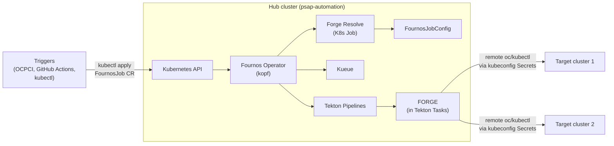
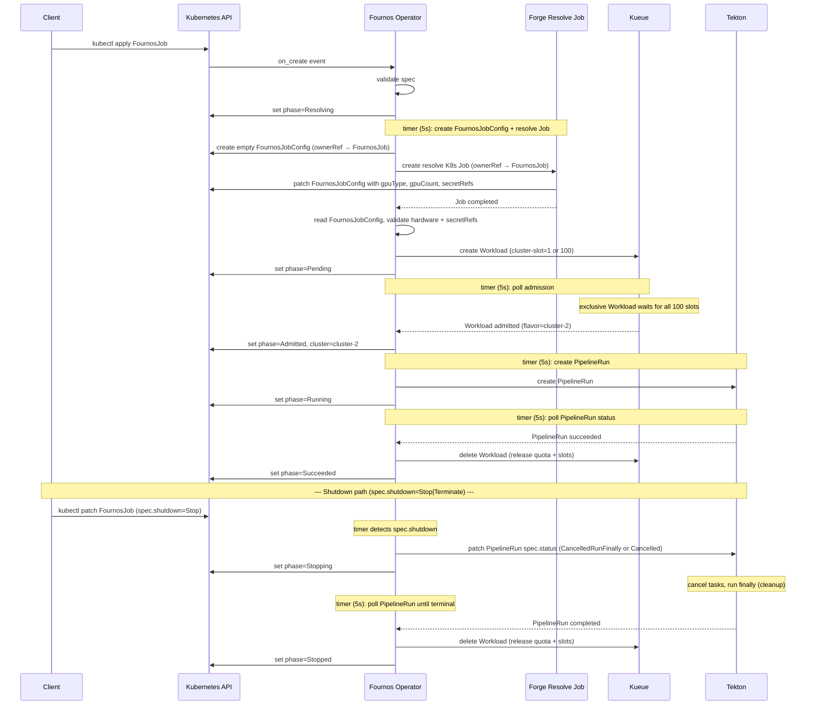

# Fournos Design Document (Tekton + Kueue)

## 1. Introduction

*Fournos* (φούρνος) = "oven" in Greek. A Kubernetes operator that accepts benchmark jobs as `FournosJob` custom resources, schedules them via Kueue, and executes them as Tekton PipelineRuns on remote clusters through the FORGE framework.

The operator is built with [kopf](https://kopf.dev/) (Kubernetes Operator Pythonic Framework) and runs as a single-replica Deployment.

## 2. Architecture overview




- **Hub cluster**: hosts the Fournos operator, Kueue, Tekton Pipelines, and FORGE (running inside Tekton Task pods) in the `psap-automation` namespace
- **Target clusters**: nothing installed — FORGE runs on the hub cluster inside Tekton Task pods and communicates with targets via remote `oc`/`kubectl` commands using kubeconfig Secrets
- **Consumers**: interact via `kubectl` (or any Kubernetes client) to create/watch/delete `FournosJob` CRs

## 3. FournosJob CRD

Jobs are submitted as `FournosJob` custom resources ([manifests/crd.yaml](manifests/crd.yaml)).

### Spec


| Field                        | Required     | Description                                                                                      |
| ---------------------------- | ------------ | ------------------------------------------------------------------------------------------------ |
| `spec.forge.project`         | yes          | FORGE project path                                                                               |
| `spec.forge.args`            | yes          | List of arguments passed to FORGE                                                                |
| `spec.forge.configOverrides` | no           | Arbitrary YAML overrides passed to the test framework                                            |
| `spec.env`                   | no           | Environment variables passed to the pipeline as a `KEY=VALUE` env file                           |
| `spec.cluster`               |              | Pin to a specific cluster (Kueue ResourceFlavor)                                                 |
| `spec.hardware.gpuType`      |              | Short GPU model name (e.g. `a100`, `h200`). The operator adds the resource prefix automatically. |
| `spec.hardware.gpuCount`     | with gpuType | Number of GPUs (minimum 1)                                                                       |
| `spec.owner`                 | no           | Team or individual that owns this job                                                            |
| `spec.displayName`           | no           | Human-readable job name (defaults to `metadata.name`)                                            |
| `spec.pipeline`              | no           | Tekton Pipeline name (default: `fournos-full`)                                                   |
| `spec.priority`              | no           | Kueue WorkloadPriorityClass name                                                                 |
| `spec.exclusive`             | no           | If `true`, locks the target cluster so no other FournosJob can run there. Requires `spec.cluster`. |
| `spec.shutdown`              | no           | Shutdown action: `Stop` (graceful, runs finally tasks) or `Terminate` (immediate, skips finally tasks). Both wait for the PipelineRun to finish before releasing Kueue quota. |


`spec.cluster` and `spec.hardware` are both optional. If neither is provided, Forge resolves hardware requirements during the mandatory Resolving phase. Both can be set together to pin a hardware request to a specific cluster.

`metadata.name` is the unique identifier for the job. Use `metadata.generateName` for auto-generated unique names (e.g. `generateName: nightly-benchmark-` produces `nightly-benchmark-x7k2m`). `spec.displayName` is a human-readable label for external correlation — it does not need to be unique and is passed to the pipeline as `job-name`.

### Status

The operator writes status to `.status`:


| Field          | Description                                                 |
| -------------- | ----------------------------------------------------------- |
| `phase`        | `Resolving` → `Pending` → `Admitted` → `Running` → `Succeeded` / `Failed` / `Stopping` → `Stopped` |
| `cluster`      | Cluster assigned by Kueue                                   |
| `pipelineRun`  | Name of the Tekton PipelineRun                              |
| `dashboardURL` | Tekton Dashboard link (if configured)                       |
| `message`      | Error details on failure                                    |


### Example

```yaml
apiVersion: fournos.dev/v1
kind: FournosJob
metadata:
  generateName: nightly-llama3-
  namespace: psap-automation
spec:
  owner: perf-team
  displayName: nightly-llama3-benchmark
  cluster: cluster-1
  forge:
    project: testproj/llmd
    args:
      - cks
    configOverrides:
      batch_size: 64
  env:
    OCPCI_SUITE: regression
    OCPCI_VARIANT: nightly
```

```bash
kubectl create -f job.yaml           # returns the generated name, e.g. nightly-llama3-x7k2m
kubectl get fournosjobs -w           # watch status transitions
kubectl delete fournosjob <name>     # cleanup
```

### FournosJobConfig CRD

The `FournosJobConfig` CR ([manifests/crd-jobconfig.yaml](manifests/crd-jobconfig.yaml)) stores resolved job requirements populated by Forge during the Resolving phase. The operator pre-creates an empty instance (owned by the FournosJob) and the Forge resolve Job patches it with the resolved values.

| Field                   | Description                                                                                  |
| ----------------------- | -------------------------------------------------------------------------------------------- |
| `spec.hardware.gpuType` | Short GPU model name (e.g. `a100`, `h200`). Overridden by `FournosJob.spec.hardware` if set. |
| `spec.hardware.gpuCount`| Number of GPUs required. Overridden by `FournosJob.spec.hardware` if set.                    |
| `spec.secretRefs`       | Vault entry names to mount into the pipeline. Each name must correspond to a K8s Secret with the `fournos.dev/vault-entry=true` label. |

## 4. Scheduling

All jobs flow through Kueue — there is one scheduling path with different constraint levels:


| User specifies                             | Workload nodeSelector                          | Kueue behavior                                                          |
| ------------------------------------------ | ---------------------------------------------- | ----------------------------------------------------------------------- |
| `cluster: "cluster-1"`                     | `fournos.dev/cluster: cluster-1`               | Only the `cluster-1` flavor is eligible. Queues if the cluster is full. |
| `hardware: {gpuType: "a100", gpuCount: 2}` | *(none)*                                       | All flavors with enough A100 quota are eligible. Kueue picks first fit. |
| Both                                       | `fournos.dev/cluster: cluster-1` + GPU request | Specific hardware on a specific cluster.                                |


Each ResourceFlavor has `spec.nodeLabels: { fournos.dev/cluster: <name> }`. When `cluster` is specified, the operator sets a matching `nodeSelector` on the Workload's podSet template so Kueue constrains admission to that flavor.

### Exclusive cluster locking

When `spec.exclusive: true` is set (requires `spec.cluster`), the operator enforces full exclusivity using a **Kueue cluster-slot semaphore**:

- Every Kueue `ClusterQueue` flavor carries a virtual resource `fournos/cluster-slot` with a quota of 100.
- **Normal jobs** request 1 cluster-slot in their Workload.
- **Exclusive jobs** request all 100 cluster-slots for their target cluster.

This means Kueue itself enforces exclusivity atomically:
- While an exclusive Workload holds all 100 slots, no other Workload can be admitted to that cluster (0 slots remaining).
- An exclusive Workload cannot be admitted while any other Workload holds even 1 slot on that cluster (only 99 slots available, but 100 needed).
- Hardware-only jobs are automatically steered to clusters with available slots — no operator-side anti-affinity is needed.

The lock is implicitly released when the exclusive job completes and the operator deletes its Workload, freeing all 100 slots. No operator-level blocking phase, labels, or in-memory state is required.

### Job lifecycle




1. **on_create**: Operator validates the spec (cluster exists if specified, `exclusive` requires `cluster`). If `spec.shutdown` is set (`Stop` or `Terminate`), immediately sets `phase=Stopped`. Otherwise sets `phase=Resolving`.
2. **timer (Resolving)**: Creates an empty `FournosJobConfig` CR (owned by the FournosJob), then launches a Forge resolve K8s Job that populates the config with `gpuType`, `gpuCount`, and `secretRefs`. Polls the Job for completion. On success, reads the `FournosJobConfig`, validates hardware (user-provided `spec.hardware` takes precedence over config values; GPU type checked against Kueue), validates `secretRefs` against Vault secrets, creates the Kueue Workload (exclusive jobs request all 100 `fournos/cluster-slot` units; normal jobs request 1), and sets `phase=Pending`. Failed resolve Jobs are preserved for debugging.
3. **timer (Pending)**: Polls the Workload for Kueue admission. On admission, extracts the assigned cluster and sets `phase=Admitted`.
4. **timer (Admitted)**: Reads `secretRefs` from the `FournosJobConfig`, resolves the kubeconfig Secret, creates the Tekton PipelineRun with `ownerReferences` pointing at the FournosJob, sets `phase=Running`.
5. **timer (Running)**: Polls the PipelineRun for completion. On success/failure, deletes the Workload and sets `phase=Succeeded` or `phase=Failed`.
6. **timer (any non-terminal phase, shutdown)**: If `spec.shutdown` is set (`Stop` or `Terminate`) and the job has a PipelineRun (Admitted/Running), the timer cancels the PipelineRun — `Stop` uses Tekton's `CancelledRunFinally` (runs `finally` tasks), `Terminate` uses `Cancelled` (skips `finally` tasks) — and sets `phase=Stopping`. The Workload is **not** deleted yet — it stays alive to hold the cluster slot while the PipelineRun winds down. If no PipelineRun exists (Pending), the Workload is deleted immediately and the job goes straight to `phase=Stopped`.
7. **timer (Stopping)**: Polls the PipelineRun until it reaches a terminal state (`succeeded` or `failed`). Once complete, deletes the Workload to release Kueue quota and sets `phase=Stopped`.

Deleting a FournosJob triggers Kubernetes cascade deletion of its owned Workload and PipelineRun via `ownerReferences` — no explicit cleanup handler is needed.

Benefits of the unified path:

- Quota is always tracked, even for cluster-pinned jobs
- If the requested cluster is full, the job queues instead of failing
- Priority ordering applies consistently
- One code path for scheduling (simpler)

## 5. Operator handlers

The operator is split across several modules:

- **`fournos/operator.py`** — kopf-decorated entry points (startup, create/resume, timer) and background GC. Delegates all business logic to the handlers package.
- **`fournos/handlers/`** — phase handler package:
  - `status.py` — condition helpers, `owner_ref`, `create_workload_for_job`, shared constants
  - `lifecycle.py` — `on_create`, `reconcile_pending` (early phases)
  - `resolving.py` — `reconcile_resolving` (Forge resolve Job management, FournosJobConfig validation, Workload creation)
  - `execution.py` — `reconcile_admitted`, `reconcile_running` (PipelineRun management), `handle_shutdown` / `reconcile_stopping` (shutdown flow)
- **`fournos/core/resolve.py`** — `ResolveClient` for managing Forge resolve K8s Jobs and `FournosJobConfig` CRs (create, read, status)
- **`fournos/state.py`** — shared client instances (`_OperatorState` dataclass with `kueue`, `tekton`, `registry`, `resolve`)

Kopf handlers registered in `operator.py`:


| Handler                               | Trigger                                                        | Responsibility                                                               |
| ------------------------------------- | -------------------------------------------------------------- | ---------------------------------------------------------------------------- |
| `@kopf.on.startup`                    | Process start                                                  | Load kubeconfig, initialise clients into `state.ctx`, start resource GC thread |
| `@kopf.on.create` / `@kopf.on.resume` | New or existing CR                                             | Validate spec, set `phase=Resolving` |
| `@kopf.timer(interval=5.0)`           | Every 5s while phase ∈ {Resolving, Pending, Admitted, Running, Stopping}  | Drive the state machine: Resolving creates FournosJobConfig + Forge Job, validates results, creates Workload; Pending polls admission; Admitted creates PipelineRun; Running polls completion; Stopping polls PipelineRun for completion. Shutdown is checked in every non-terminal phase. |


The timer's `when` guard ensures it stops firing once the job reaches a terminal phase (`Succeeded`, `Failed`, or `Stopped`), so completed jobs have zero ongoing overhead.

Validation failures (unknown cluster, `exclusive` without `cluster`) result in immediate `phase=Failed` with a descriptive `message` during `on_create`. Hardware and secretRef validation failures occur during the Resolving phase after the Forge Job completes.

### Resource GC

A background daemon thread runs a garbage collection loop at a configurable interval (`FOURNOS_GC_INTERVAL_SEC`, default 300s). It lists all fournos-managed Workloads and PipelineRuns (by label `app.kubernetes.io/managed-by=fournos`), reads the `fournos.dev/job-name` label on each, and deletes any whose parent `FournosJob` CR no longer exists. This serves as a safety net for resources that somehow lost their `ownerReferences` (e.g. created before ownership was added, or manually recreated).

## 6. Persistence

Job state is stored entirely in Kubernetes resources — no in-memory store:

- **FournosJob CRs**: the primary user-facing resource; `.status` tracks phase, assigned cluster, PipelineRun name, dashboard URL
- **FournosJobConfig CRs**: resolved hardware requirements and secret references, populated by the Forge resolve Job during the Resolving phase
- **Kueue Workloads**: carry job name as labels; admission state from conditions and `status.admission.podSetAssignments`
- **Tekton PipelineRuns**: carry job name as labels; execution status from conditions

The operator is stateless and crash-safe. On restart, `@kopf.on.resume` re-evaluates existing CRs and the timer picks up where it left off.

## 7. FORGE integration

FORGE is an existing benchmark execution framework that runs on the hub cluster inside Tekton Task pods and owns all operations on target clusters — setup, benchmark execution, and cleanup — by issuing remote `oc`/`kubectl` commands via kubeconfig Secrets. Fournos has a strict separation of concerns: it handles cluster selection, scheduling, and bookkeeping, but never interacts with target clusters directly.

The operator passes FORGE configuration to the Tekton Pipeline as two params:

- **`forge-project`** — `spec.forge.project` as a plain string, for direct use in task scripts (e.g. `bin/run_ci "$(params.forge-project)" ci "$FOURNOS_STEP"`)
- **`forge-config`** — the entire `spec.forge` dict serialized as YAML, written to `forge_config.yaml` in the task for FORGE to consume

Environment variables (`spec.env`) are serialized as `KEY=VALUE` lines and passed as the `env` param. Tasks write this to `forge_config.env` and source it before invoking FORGE.

Fournos also passes `job-name` (from `spec.displayName` or `metadata.name`) so FORGE can use it for its own resource naming and correlation.

**Hub configuration vs mocks:** `config/forge/` is the authoritative layout for deploying FORGE on the hub (workflows, images, samples). Tasks in `config/forge/workflows/tasks.yaml` and `config/fournos-validation/workflows/tasks.yaml` implement the parameter interface for real clusters. `dev/mock-pipelines/` holds echo/sleep Tekton stand-ins used only by kind-based dev setup and tests—not a substitute for `config/forge/`.

## 8. Tekton Pipelines and Tasks

The Task and Pipeline YAML checked in under `config/forge/workflows/` is what you apply on OpenShift for real workloads. Pipelines under `dev/mock-pipelines/` exist for local kind clusters and automated tests; they reuse the same `spec.pipeline` names but are not the production FORGE definitions.

### Tasks ([config/forge/workflows/tasks.yaml](config/forge/workflows/tasks.yaml))

FORGE-owned tasks (stubs in this repo, replaced by real FORGE implementation):


| Task              | Description                                         |
| ----------------- | --------------------------------------------------- |
| `fournos-prepare` | FORGE: set up the target cluster                    |
| `fournos-run`     | FORGE: run the benchmark against the target cluster |
| `fournos-cleanup` | FORGE: clean up resources on the target cluster     |


### Pipelines


| Pipeline           | File                                                              | Tasks         | Finally  |
| ------------------ | ----------------------------------------------------------------- | ------------- | -------- |
| `fournos-full`     | [pipeline-full.yaml](config/forge/workflows/pipeline-full.yaml)         | prepare → run | cleanup  |
| `fournos-run-only` | [pipeline-run-only.yaml](dev/mock-pipelines/pipeline-run-only.yaml) *(kind / tests)* | run           | *(none)* |

For a run-only pipeline in real hub deployments, use [pipeline-test-only.yaml](config/forge/workflows/pipeline-test-only.yaml) (`forge-test-only`).

The `spec.pipeline` field in `FournosJob` selects which pipeline to use (default: `fournos-full`).

Completion detection is handled by the operator's timer polling PipelineRun conditions — no callback task is needed.

## 9. Kueue configuration

[config/kueue-cluster-config.yaml](config/kueue-cluster-config.yaml):

- **ResourceFlavors**: one per cluster, with `nodeLabels: { fournos.dev/cluster: <name> }` for cluster-pinned scheduling
- **ClusterQueue** `fournos-queue`: per-cluster GPU quotas using virtual resource `fournos/gpu-{type}`, plus `fournos/cluster-slot` (quota 100 per flavor) for the exclusive locking semaphore
- **WorkloadPriorityClasses** (v1beta2): `manual`, `nightly`, `presubmit`, `adhoc`

[config/kueue-config.yaml](config/kueue-config.yaml):

- **LocalQueue** `fournos-queue` in the Fournos namespace (references the cluster `ClusterQueue`)

## 10. Deployment

Namespace-scoped tenant on a shared OpenShift management cluster:

- [manifests/crd.yaml](manifests/crd.yaml) — FournosJob CustomResourceDefinition
- [manifests/crd-jobconfig.yaml](manifests/crd-jobconfig.yaml) — FournosJobConfig CustomResourceDefinition
- [manifests/rbac](manifests/rbac) — ClusterRole + ClusterRoleBinding for Kueue cluster resources; Role + RoleBinding for FournosJob, FournosJobConfig, PipelineRun, Job, Secret access
- [manifests/deployment.yaml](manifests/deployment.yaml) — Deployment in `psap-automation` with liveness probe
- [Containerfile](Containerfile) — Python base image, pip install, `kopf run` entrypoint with liveness endpoint

```bash
kubectl apply -f manifests/crd.yaml
kubectl apply -f manifests/crd-jobconfig.yaml
for rbac_file in manifests/rbac/*.yaml; do
  cat "$rbac_file" | NAMESPACE=$FOURNOS_NAMESPACE envsubst | oc apply -f- -n $FOURNOS_NAMESPACE
done
kubectl apply -f config/kueue-config.yaml
kubectl apply -f config/kueue-cluster-config.yaml
kubectl apply -f manifests/deployment.yaml
```

## 11. Configuration

All settings via environment variables with `FOURNOS_` prefix ([fournos/settings.py](fournos/settings.py)):


| Variable                            | Default                | Description                    |
| ----------------------------------- | ---------------------- | ------------------------------ |
| `FOURNOS_NAMESPACE`                 | `psap-automation`      | Kubernetes namespace           |
| `FOURNOS_TEKTON_DASHBOARD_URL`      | *(empty)*              | Tekton Dashboard base URL      |
| `FOURNOS_KUBECONFIG_SECRET_PATTERN` | `{cluster}-kubeconfig` | Secret name pattern            |
| `FOURNOS_KUEUE_LOCAL_QUEUE_NAME`    | `fournos-queue`        | Kueue LocalQueue name          |
| `FOURNOS_GPU_RESOURCE_PREFIX`       | `fournos/gpu-`         | Virtual resource name prefix   |
| `FOURNOS_LOG_LEVEL`                 | `INFO`                 | Logging level                  |
| `FOURNOS_GC_INTERVAL_SEC`           | `300`                  | Resource GC interval (seconds) |
| `FOURNOS_FORGE_RESOLVE_IMAGE`       | `image-registry.openshift-image-registry.svc:5000/{namespace}/forge-core:main` | Container image for the Forge resolve Job (`{namespace}` is substituted at runtime) |
| `FOURNOS_FORGE_RESOLVE_DEADLINE_SEC` | `300`                 | Deadline for the Forge resolve Job (seconds) |


## 12. Project structure

```
fournos/
  operator.py              # kopf wiring layer (startup, create/resume, timer, GC)
  state.py                 # Shared client instances (_OperatorState dataclass)
  settings.py              # Pydantic Settings (env vars)
  handlers/
    __init__.py            # Re-exports for operator.py
    status.py              # Condition helpers, owner_ref, create_workload_for_job
    lifecycle.py           # on_create, reconcile_pending
    resolving.py           # reconcile_resolving (Forge resolve Job, FournosJobConfig validation, Workload creation)
    execution.py           # reconcile_admitted, reconcile_running
  core/
    constants.py           # Shared label keys, Phase enum, cluster-slot constants
    clusters.py            # ClusterRegistry (kubeconfig lookup, secretRef resolution)
    resolve.py             # ResolveClient (Forge resolve Job + FournosJobConfig CRUD)
    tekton.py              # TektonClient (PipelineRun CRUD)
    kueue.py               # KueueClient (Workload CRUD, admission checks, cluster-slot requests)
manifests/
  crd.yaml                 # FournosJob CustomResourceDefinition
  crd-jobconfig.yaml       # FournosJobConfig CustomResourceDefinition
  rbac/                    # Role, ClusterRole, RoleBinding, ClusterRoleBinding, ServiceAccount
  deployment.yaml          # Deployment
config/
  kueue-cluster-config.yaml # ResourceFlavors, ClusterQueue, WorkloadPriorityClasses
  kueue-config.yaml        # LocalQueue (namespace-scoped)
  forge/                   # Hub cluster: real FORGE ImageStreams, Builds, Tekton workflows, samples (not mocks)
dev/
  setup.sh                 # kind cluster setup (Tekton + Kueue + CRDs + mock resources + mock resolve image)
  mock-kueue-config.yaml   # Dev Kueue config (mock clusters, quotas)
  mock-pipelines/          # Echo/sleep Tekton Tasks and Pipelines for kind only
  mock-resolve/            # Mock Forge resolve image (Dockerfile + resolve.sh) for local dev/CI
  sample-job.yaml          # Example FournosJob CR for testing
tests/
  conftest.py              # Fixtures (kubernetes client, helpers, cleanup)
  test_scheduling.py       # Cluster pin, hardware, both, alt pipeline, inadmissible, wrong GPU, optional spec fields
  test_validation.py       # Unknown cluster, admitted without flavor
  test_resolving.py        # Resolving phase: happy paths, hardware precedence, Forge failures, GPU validation
  test_lifecycle.py        # Workload cleanup, delete cleanup, list, filter by phase
  test_resource_gc.py      # Stale Workload/PipelineRun garbage collection
  test_exclusive.py        # Exclusive cluster locking (happy path, blocking, occupancy, lock release)
  test_shutdown.py         # Job shutdown (stop, terminate, at creation, completed no-op)
  test_secret_refs.py      # End-to-end: Vault sync → secretRef resolution → PipelineRun
hacks/
  sync_vault_secrets.py    # Sync secrets from HashiCorp Vault to K8s (manual, on-demand)
Containerfile
Makefile                   # dev-setup, dev-run, test, dev-teardown, ci-setup, ci-run, ci-stop, lint, format
pyproject.toml
.pre-commit-config.yaml    # ruff lint + format hooks
README.md
```

## 13. Key design decisions

- **CRD-based operator** (kopf) — consumers interact via `kubectl` / Kubernetes API, getting RBAC, audit logging, and `kubectl wait` for free
- **Unified Kueue scheduling** — all jobs flow through Kueue for consistent quota tracking and priority ordering. Cluster-pinned jobs use `nodeSelector` to constrain admission to a single ResourceFlavor; hardware-request jobs leave all flavors eligible.
- **Separation of concerns** — Fournos owns scheduling, bookkeeping, and parameter passing; FORGE owns all target-cluster operations (setup, execution, cleanup). Fournos never touches target clusters directly.
- **FORGE is opaque** — Fournos never validates FORGE config; the entire `spec.forge` dict is serialized as YAML and passed through to the Tekton Pipeline alongside `spec.forge.project` as a convenience string param
- **Tekton for execution, Kueue for scheduling** — virtual Workload pattern with `fournos/gpu-`* resources
- **Stateless operator** — all job state lives in Kubernetes resources (FournosJob CRs, PipelineRuns, Workloads), not in memory. Crash-safe via `on_resume`.
- **Timer-based reconciliation** — the operator polls Workload admission and PipelineRun completion via a kopf timer (5s interval), eliminating the need for callback tasks or watch streams on third-party resources
- **Operator cleans up on completion** — Kueue Workloads are deleted when the PipelineRun reaches a terminal state, releasing quota without relying on external callbacks
- **ownerReferences for cascade deletion** — Workloads and PipelineRuns carry `ownerReferences` pointing at their FournosJob, so Kubernetes automatically cascade-deletes them when the job is removed
- **Exclusive locking via Kueue semaphore** — each cluster flavor has 100 `fournos/cluster-slot` units. Normal jobs request 1 slot; exclusive jobs request all 100. Kueue enforces mutual exclusion atomically — no operator-level blocking, labels, or in-memory state needed. Hardware-only jobs are automatically steered to clusters with available slots.
- **Shutdown via spec field** — the `spec.shutdown` enum supports two modes: `Stop` (Tekton `CancelledRunFinally` — runs `finally` cleanup tasks) and `Terminate` (Tekton `Cancelled` — skips `finally` tasks). Both transition to an intermediate `Stopping` phase while the PipelineRun winds down. The Workload (and its quota) is kept alive until the PipelineRun completes, ensuring the cluster slot is not released prematurely. Only then does the operator delete the Workload and set `phase=Stopped`. The enum is extensible for future shutdown strategies. The FournosJob stays around in `Stopped` phase for inspection, unlike deletion which cascades and removes the record.
- **Mandatory Resolving phase with FournosJobConfig** — every job passes through a `Resolving` phase before entering `Pending`. During this phase, a Forge K8s Job runs to determine hardware requirements (`gpuType`, `gpuCount`) and secret references (`secretRefs`). Results are written to a dedicated `FournosJobConfig` CR (owned by the FournosJob via `ownerReferences`). The operator pre-creates an empty `FournosJobConfig` and passes its name to the Forge Job. User-provided `spec.hardware` takes precedence over Forge-resolved values. The `FournosJob` spec is never mutated by the operator — resolved data always lives in the separate `FournosJobConfig`. Failed resolve Jobs are preserved for debugging.
- **Vault-based secret management** — pipeline secrets originate in a HashiCorp Vault and are synced to K8s Secrets on demand via `hacks/sync_vault_secrets.py`. The K8s Secret name matches the Vault entry name exactly (entries that are not valid DNS-1123 names are rejected during sync). Each synced Secret carries a `fournos.dev/vault-entry=true` label. Secret references are resolved by Forge during the Resolving phase and stored in `FournosJobConfig.spec.secretRefs`. The operator validates them against Vault secrets before creating the Workload (during Resolving) and again before creating the PipelineRun (during Admitted). Missing or non-vault refs fail the job immediately rather than creating a broken PipelineRun.
- **Multiple pipelines** — `fournos-full` (prepare → run → cleanup) and `fournos-run-only` (run only), selectable per job
- **Target clusters need nothing installed** — FORGE runs on the hub cluster inside Tekton Task pods and communicates with targets via remote `oc`/`kubectl` commands through kubeconfig Secrets

